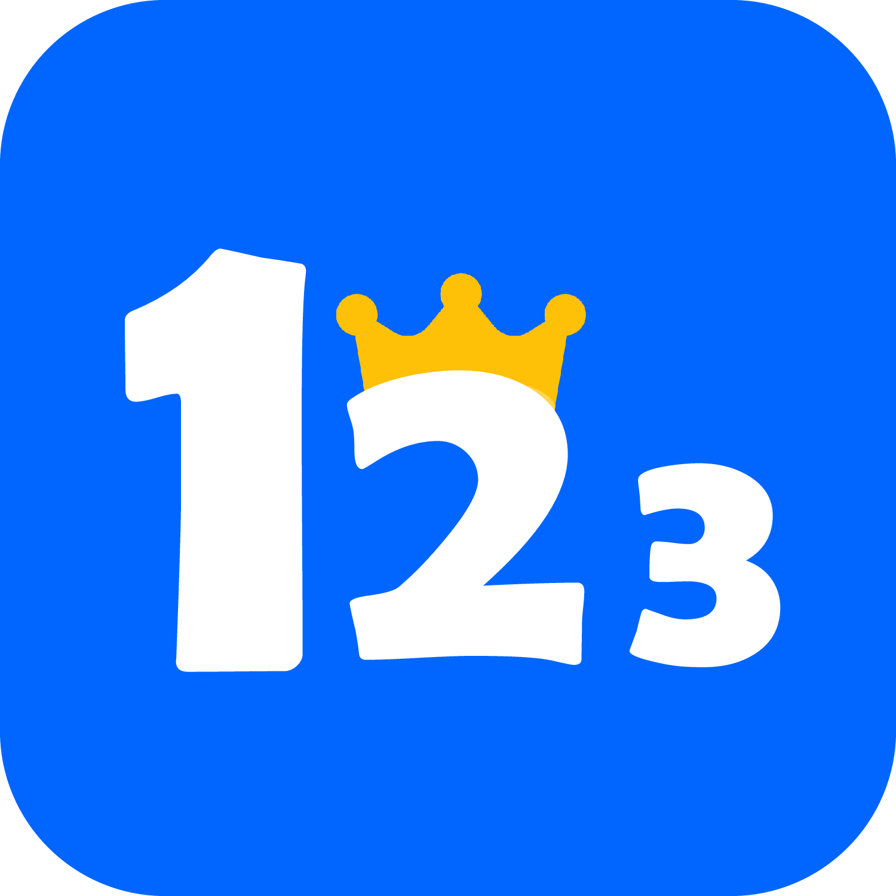
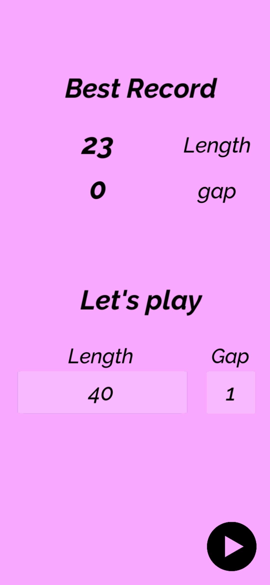
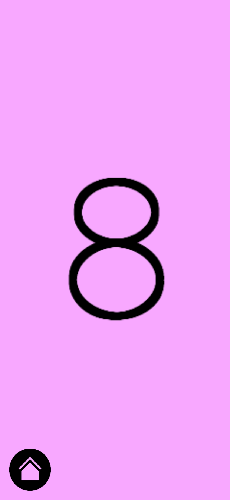
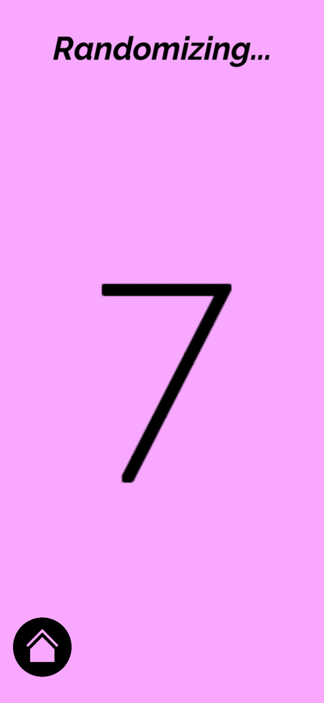
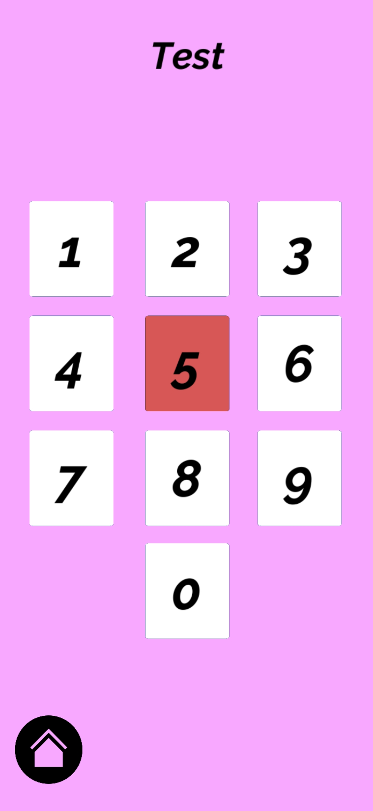
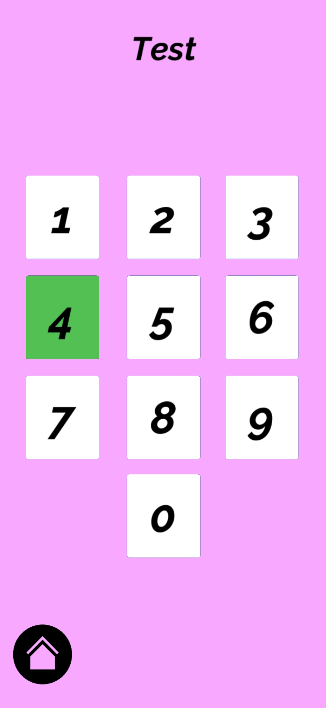
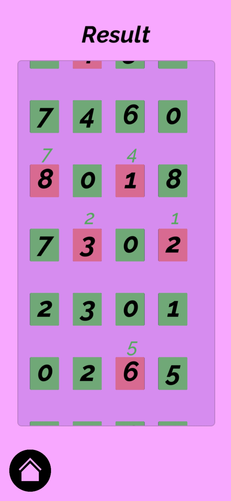

<h1 align="center">
  
  
 

  </h1>
<h3 align="center">  
  
Memoric
  </h3> 

## General

This mobile app was developed using C# and Unity.  
It was made for a personal reason -
to easily practice advanced memory techniques,  
taught by the memory expert Eran Katz.

Currently, this app supports only a practice of numeric memory.  
In the future, it will support also physical items, imagery memory, dates, people's faces, phone numbers, Pi, flags, countries, capitals, presidents and more.  
In addition it will support speach recognition to enable practicing at the roads,  
along with different languages.

In addition, it will be adjusted to help everyone, in any level :
- Children who want to enhance cognitive skills
- Professional memory competitors
- Adults who want to keep the mind sharp
  
## Screenshots

 
 
 

 

