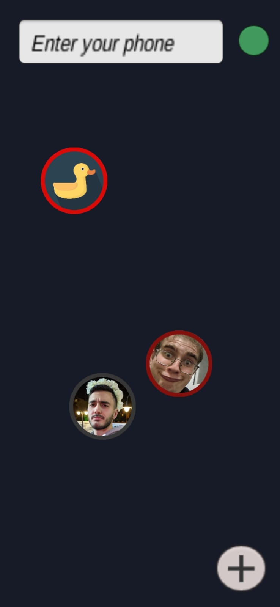
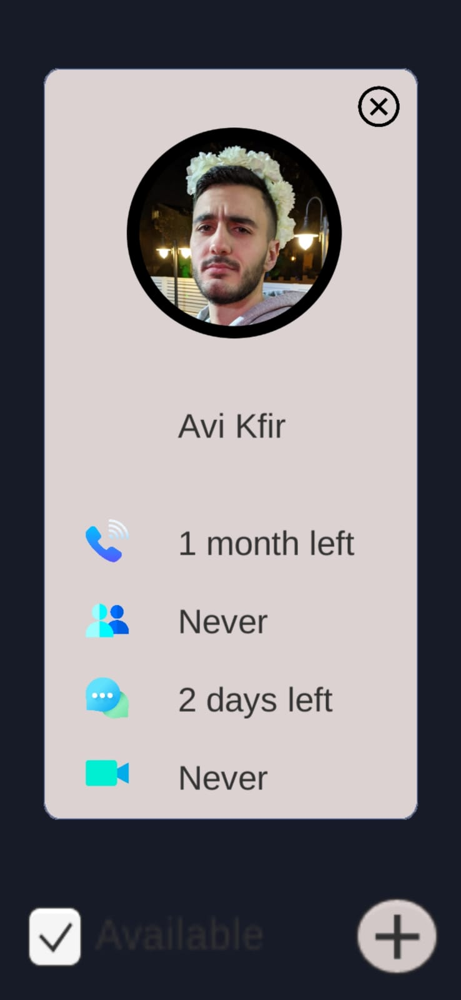
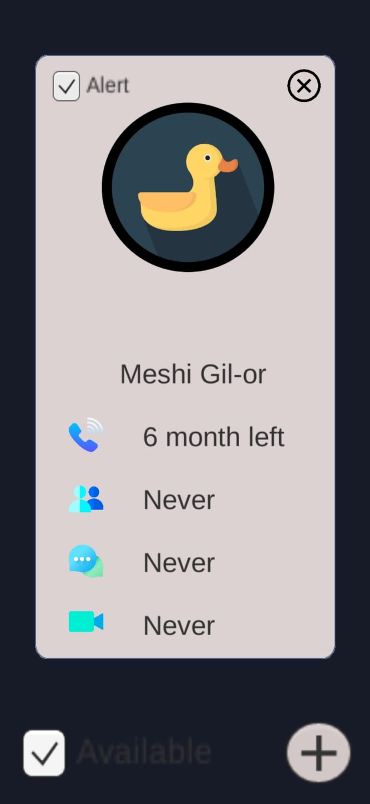
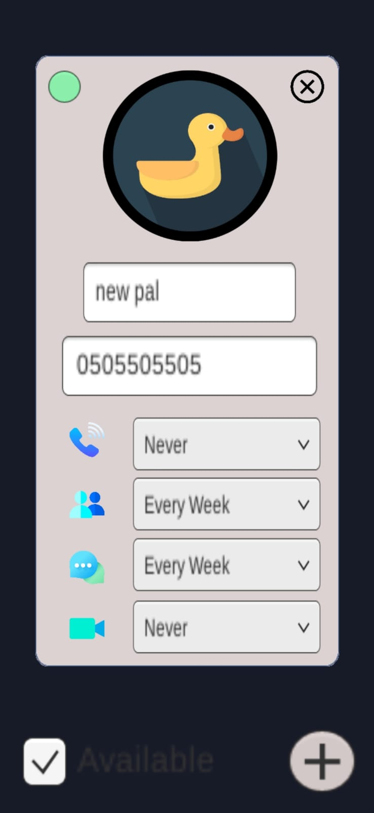

<h1 align="center">
  
  
 

  </h1>
<h3 align="center">  
  
Noumeric - practice your numeric memory.
  </h3> 

## General

This mobile app is a personal project aiming to help myself practicing advanced memory techniques that are taught by the international memory expert Eran Katz.

In the future, the app will also support a practice of imagery memory, dates, phone numbers and more . In addition, it will be adjusted to help everyone :
- Children who want to enhance cognitive skills
- Memory enthusiasts who want to proceed to the next level
- Adults who want to keep the mind sharp
  
## Screenshots

 
 
 
 

## Teammates 
- Ohad Klein
- Eitan Leviev
- Ethan Glick
- Aviel Raclaw
- Avi Kfir
