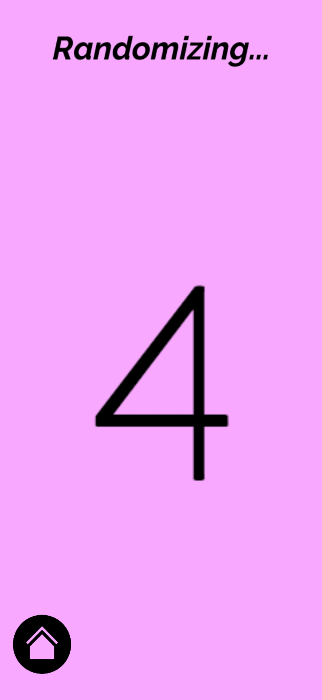

<h1 align="center">
  
  
 

  </h1>
<h3 align="center">  
  
Memoric
  </h3> 

## General

This mobile app was developed for a personal reason -  
to easily practice some advanced memory techniques.

Currently, this app supports only a practice of numeric memory.  
In the future, it will support also imagery memory.  
Furthermore, it will enable to interactively memorize important numbers  
for example: phone numbers, π digits, credit cards, passwords etc.

Lastly, it will support speach recognition to enable practicing at the roads,  
along with different languages.
  
## Screenshots

 
 
 

 

